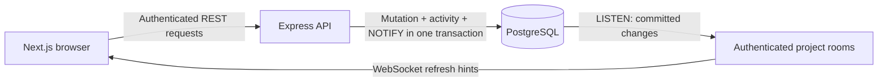

# CollabFlow

A full-stack academic project collaboration platform for college student teams and faculty mentors. Students can create project workspaces, divide tasks among team members, and track progress. Faculty guides can monitor contributions and review milestones.

[Hosted frontend](https://collabflow-wine.vercel.app/login) ·
[CI](https://github.com/Akuma-01/CollabFlow/actions/workflows/ci.yml) ·
[Engineering walkthrough and demo](ENGINEERING.md) ·
[Deployment status and setup](backend/DEPLOYMENT.md)

## Engineering Highlights

- Four project roles with resource-scoped authorization; queued mutations recheck
  permissions under a PostgreSQL project-row lock.
- Per-login refresh sessions with token rotation, replay detection, and revocation
  that also invalidates the session's access tokens and WebSocket subscriptions.
- Task, membership, and project changes commit with activity records and
  notifications in one transaction; rollback tests exercise failure paths.
- Authenticated WebSockets synchronize boards and history across browser sessions.
  Reconnects refetch current state, and pending writes prevent stale reads from
  replacing optimistic updates.
- Tests use disposable PostgreSQL databases, real WebSocket clients, and two
  independent browser sessions. CI also exercises the compiled production entry
  point, readiness, and shutdown.

## Tech Stack
- Next.js + React
- Node.js + Express 5
- TypeScript
- PostgreSQL
- WebSockets (`ws`) with PostgreSQL notifications
- JWT Authentication + bcrypt
- Zod validation
- Rate limiting

## Architecture



Each API process owns its project rooms and a dedicated PostgreSQL listener.
The browser refetches authorized state after hints and reconnects, coordinating
those reads with optimistic task writes. See [architecture details](backend/ARCHITECTURE.md)
for transaction boundaries, session rotation, and authorization decisions.

## Project Structure
```
collabflow/
  backend/
    config/         # DB and env configuration
    controllers/    # HTTP layer — request/response handling
    middlewares/    # Auth, role, validation, error handling
    routes/         # Route definitions
    realtime/       # Authenticated project subscriptions and PostgreSQL listener
    runtime/        # Startup, health checks, and graceful shutdown
    schemas/        # Zod validation schemas
    services/       # Business logic and DB queries
    types/          # TypeScript interfaces and types
    server.ts       # Entry point
  frontend/
    app/            # Pages, project board, and activity view
    lib/            # API client and browser synchronization
    test/           # API-client and synchronization unit tests
    e2e/            # Chromium tests with controlled HTTP/WebSocket responses
    e2e-live/       # Two-browser test against the real API and PostgreSQL
```

## Setup
1. Clone the repo
2. Copy `backend/.env.example` to `backend/.env` and fill in values
3. Prepare PostgreSQL with `backend/schema.sql` and the numbered
   [database migrations](backend/migrations/README.md)
4. Run `npm install` inside `backend/`
5. Run `npm run dev` to start development server
6. In `frontend/`, copy `.env.example` to `.env.local`, run `npm install`, and
   start the UI with `npm run dev -- --port 3001`. Its origin must match the
   backend's `FRONTEND_URL`. Set `NEXT_PUBLIC_API_URL` before building; both HTTP
   requests and WebSockets use it.

For production configuration, database TLS, health checks, and shutdown behavior,
see [deployment and operation](backend/DEPLOYMENT.md).

## Environment Variables
```
JWT_SECRET=
JWT_REFRESH_SECRET=
DB_USER=
DB_HOST=
DB_DATABASE=
DB_PASSWORD=
DB_PORT=
FRONTEND_URL=http://localhost:3001
PORT=3000
TRUST_PROXY_HOPS=0
```

## Tests and CI

The backend uses Jest and Supertest against real PostgreSQL. Each run creates a
fresh database from `backend/schema.sql` and the numbered migrations, covering
authentication, role boundaries, cross-project isolation, transactional activity
history, and concurrent mutations.

```sh
docker compose -f compose.test.yml up -d --wait
npm --prefix backend ci
npm --prefix backend test -- --runInBand
npm --prefix backend run test:startup
```

See [backend/TESTING.md](backend/TESTING.md) for isolation safeguards, focused test
commands and coverage limits. GitHub Actions runs backend tests and builds, plus
frontend unit tests, lint, controlled Chromium tests, and a real two-browser
collaboration test against PostgreSQL on pushes and pull requests. See
[frontend/TESTING.md](frontend/TESTING.md) for browser
setup and coverage.

## Project Activity

Open **Activity** beside the project board to see task, membership, role, and
project changes with actor names, timestamps, and before/after values. All project
roles can read history. Filter by event type or load older events. The newest page
updates automatically; while browsing older pages, use **Show latest activity**
to see new changes without losing your place. History survives task deletion and member removal; project deletion
removes its history. See [the activity contract](backend/ACTIVITY.md) for the API,
transaction guarantees, and retention rules.

The backend also exposes authenticated WebSocket project subscriptions at
`/projects/:projectId/events`. Committed mutations notify subscribers across API
instances through PostgreSQL; session and membership checks guard delivery.
The browser synchronizes tasks, project details, membership, and activity, restores
sessions before reconnecting, and refetches after joining the room. Pending task
writes are reconciled with fresh server state, and unfinished forms survive remote
updates. A connection indicator shows recovery; loss of access clears the view.
See [the WebSocket contract](backend/REALTIME.md)
for connection rules, failure recovery, and the limits of notification delivery.

## API Endpoints

### Health
- `GET /health/live` — process liveness without a database query
- `GET /health/ready` — PostgreSQL and notification listener readiness; 503 during recovery or shutdown

### Auth
- `POST /auth/register` — register a new user
- `POST /auth/login` — login and receive JWT token
- `GET /auth/me` — get current authenticated user
- `POST /auth/refresh` — rotate the refresh token and issue an access token
- `POST /auth/logout` — revoke the current session and clear authentication cookies

### Projects
- `GET /projects` — get all projects for logged in user
- `POST /projects` — create a new project
- `GET /projects/:projectId` — get project details with task counts
- `PATCH /projects/:projectId` — update project title
- `DELETE /projects/:projectId` — delete project
- `GET /projects/:projectId/activity` — paginated project, task, membership, and role history

### Members
- `GET /projects/:projectId/members` — list project members
- `POST /projects/:projectId/members` — add an editor, viewer, or guide
- `PATCH /projects/:projectId/members/:userId` — update member role
- `DELETE /projects/:projectId/members/:userId` — remove a member
- `POST /projects/:projectId/guides` — assign a faculty guide

### Tasks
- `GET /projects/:projectId/tasks` — get tasks (filterable by status and assignee)
- `POST /projects/:projectId/tasks` — create a task
- `PATCH /projects/:projectId/tasks/:id` — update task title/description/deadline
- `DELETE /projects/:projectId/tasks/:id` — delete a task
- `PATCH /projects/:projectId/tasks/:id/assign` — assign task to a member
- `PATCH /projects/:projectId/tasks/:id/status` — update task status

### Dashboard
- `GET /dashboard` — all projects with role and task counts for logged in user
- `GET /dashboard/tasks` — all tasks assigned to logged in user ordered by deadline

### Users
- `GET /users/search?q=...` — search users for project membership

## Roles
| Role | Description |
|------|-------------|
| owner | Full control — manages members, tasks, and project settings |
| editor | Can create, update, and delete tasks |
| viewer | Read-only access to project data |
| guide | Faculty mentor — read-only access, cannot modify anything |

## Database Schema
- `users` — id, name, email, password
- `projects` — id, title, owner_id
- `project_members` — user_id, project_id, role
- `tasks` — id, title, description, project_id, assigned_to, created_by, status, deadline, created_at
- `auth_sessions` — id, user_id, refresh_token_hash, created_at, expires_at, revoked_at
- `activity_logs` — project/actor, action, entity, JSONB metadata, timestamp;
  see [activity API and transaction rules](backend/ACTIVITY.md)

## Key Design Decisions
- Owner stored in `projects.owner_id`, not in `project_members` — avoids update anomalies
- `project_members.project_id` uses ON DELETE CASCADE — deleting a project cleans up members
- `project_members.user_id` uses ON DELETE RESTRICT — users cannot be deleted while active members
- `tasks.assigned_to` uses ON DELETE SET NULL — deleting a user unassigns their tasks
- Role-based authorization via reusable `hasRole` middleware
- Refresh-token rotation uses transactional row locks; replay and logout revoke
  the current session's access and refresh tokens without ending other device logins

## Scope and Tradeoffs

Writes within a project are serialized to keep authorization and history
consistent; separate projects can change concurrently. WebSocket notifications
are transient refresh hints, while the Activity API stores history. Reconnecting
clients fetch current state rather than replaying missed messages. These choices
fit small team workspaces; no throughput or large-scale capacity claim has been
benchmarked.

Guides currently have read-only access. Comments, invitations, email notifications,
file uploads, and institution email verification are future product decisions.
See the [engineering walkthrough](ENGINEERING.md) for demonstrated behavior,
tradeoffs, and a repeatable demo.
